# commercetools Visualizer
The commercetools Visualizer is a [custom application](https://docs.commercetools.com/merchant-center-customizations/custom-applications) related to non-standard types within the commercetools Merchant Center. It supports rendering various elements like Subscriptions, API Extensions, Types, States, Shopping Lists and Carts.

## Introduction

This repository contains components rendering non out-of-the-box types as a custom app. Currently these are:
 * [API Extensions](https://docs.commercetools.com/api/projects/api-extensions)
 * [Carts](https://docs.commercetools.com/api/projects/carts)
 * [Shopping Lists](https://docs.commercetools.com/api/projects/shoppingLists)
 * [States](https://docs.commercetools.com/api/projects/states)
 * [Subscriptions](https://docs.commercetools.com/api/projects/subscriptions)
 * [Types](https://docs.commercetools.com/api/projects/types)
 * [Custom Objects](https://docs.commercetools.com/api/projects/custom-objects)

## Installation
The commercetools Visualizer is pre-packaged to run as a connect application. Follow the public documentation on how to run a custom merchant center application in connect and how to configure it in Merchant Center.

## Screenshots

### Home Screen

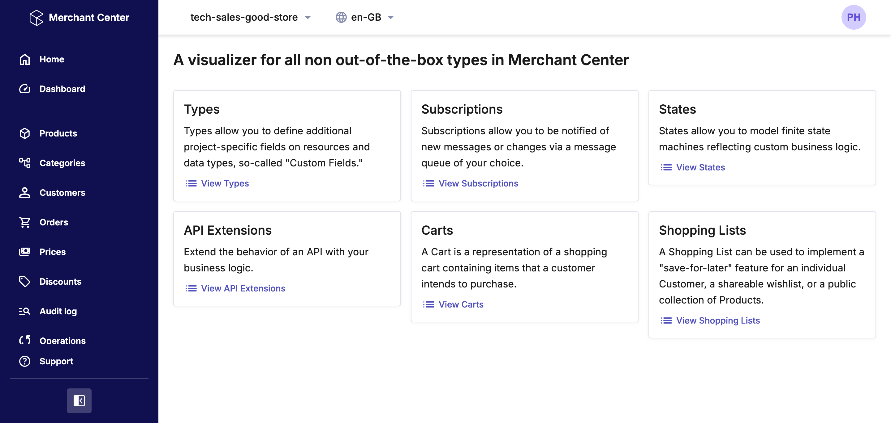

### API Extensions

List View
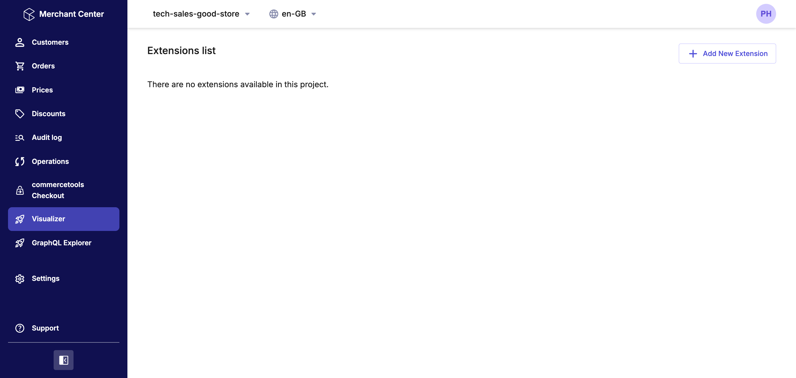
New View
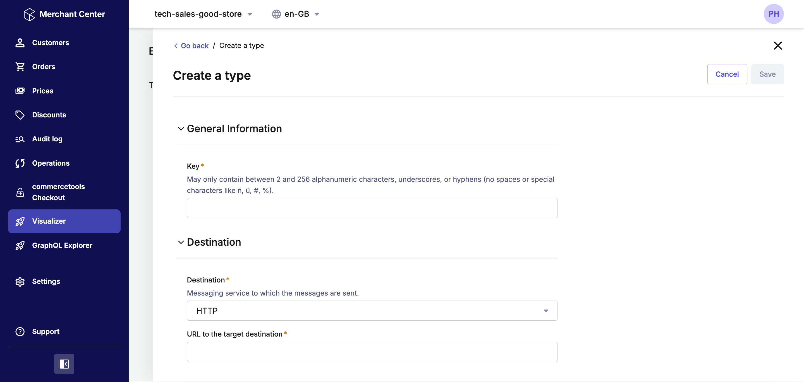

### Carts

List View
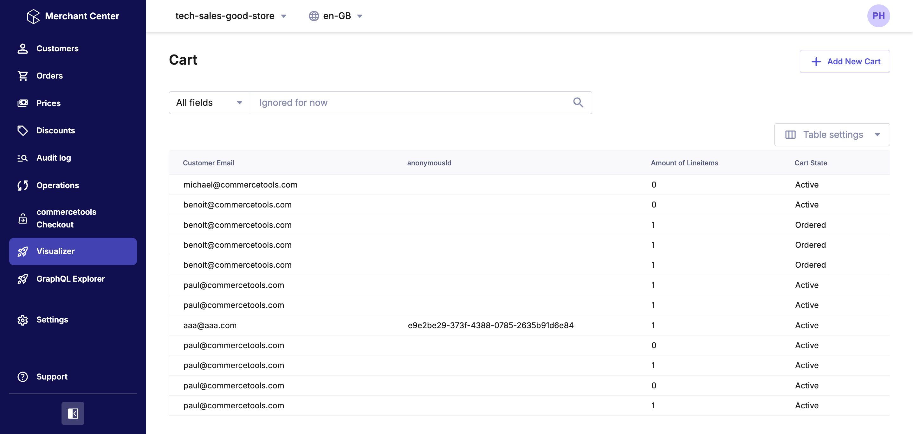
Detail View
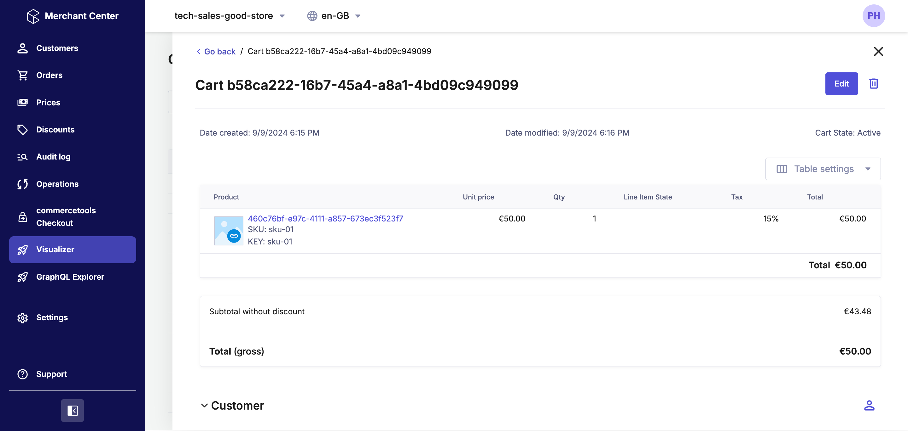
New View
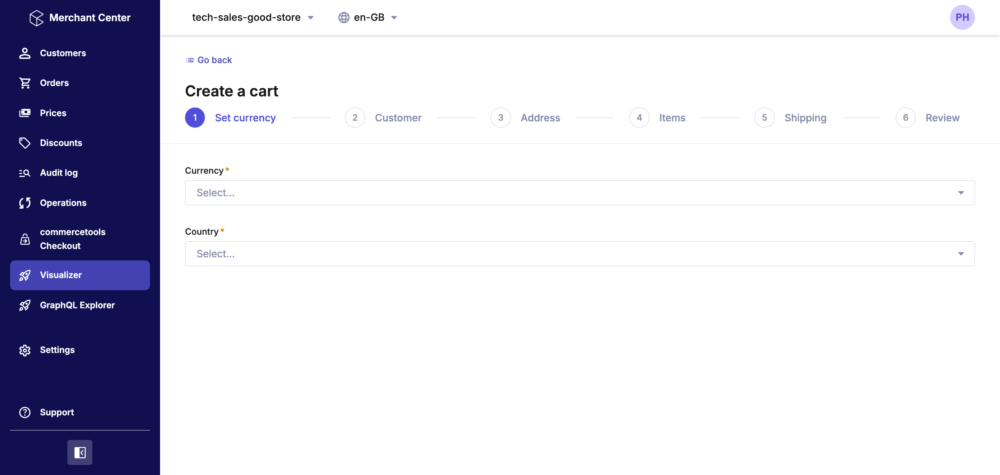

### Shopping Lists

List View
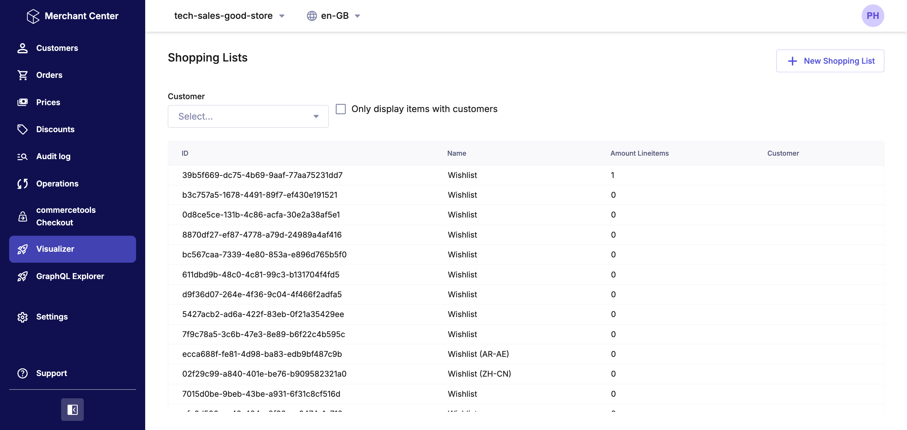
Detail View
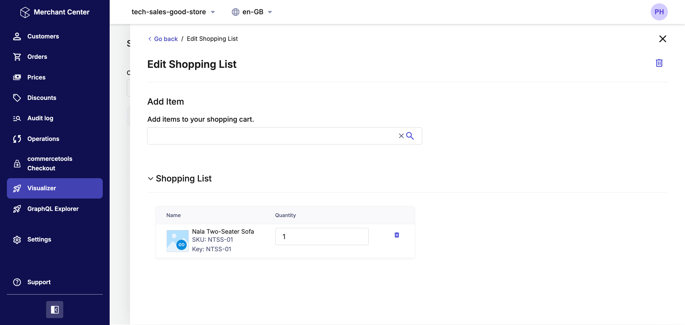
New View
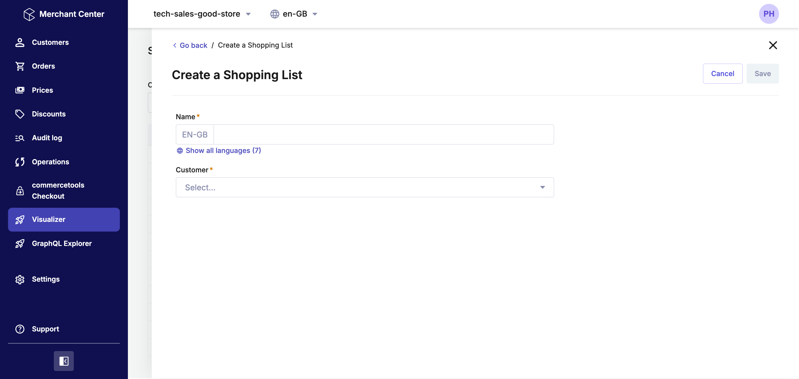

### States

List View
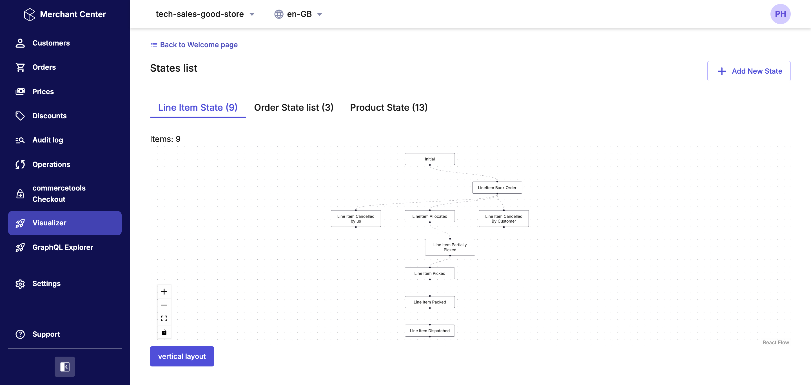
Detail View
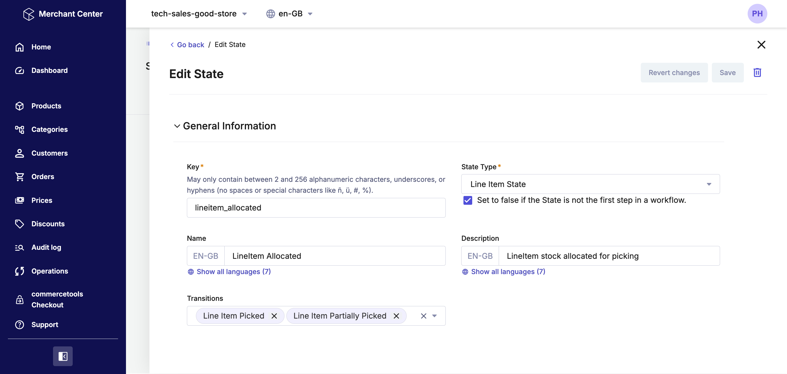
New View
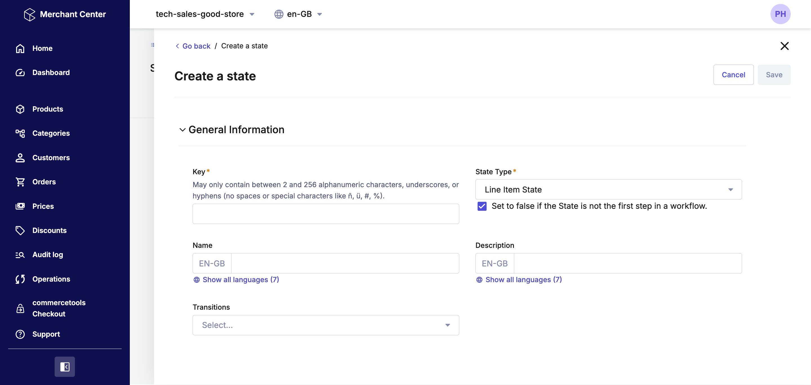

### Subscriptions

List View
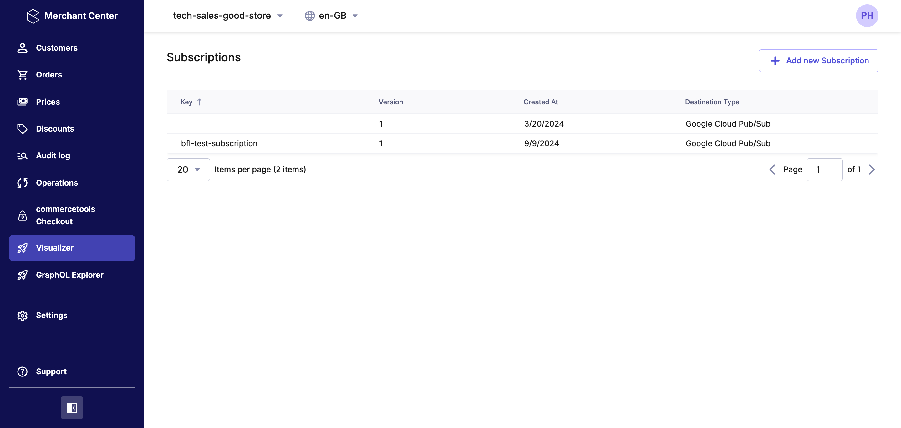
Detail View
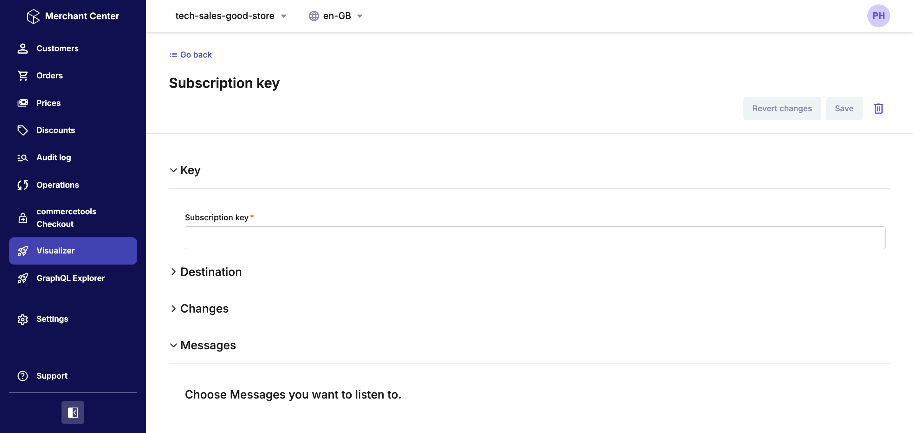
New View
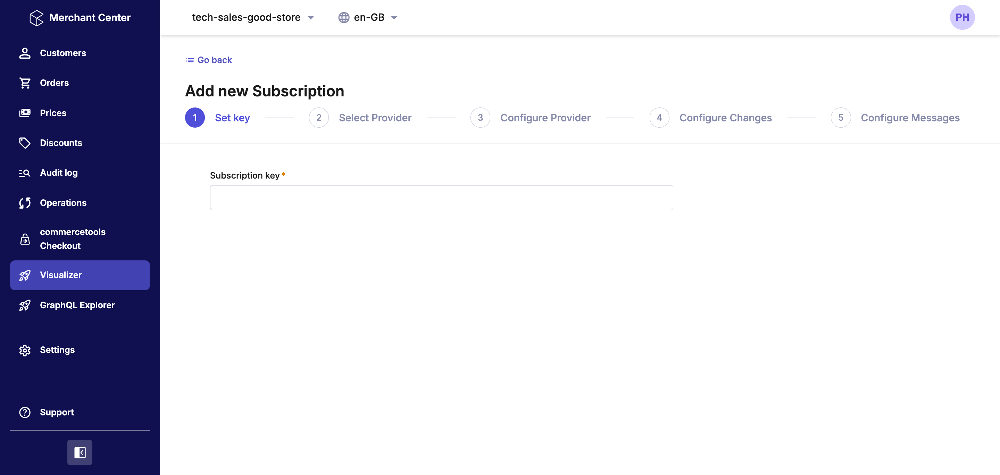

### Types

List View
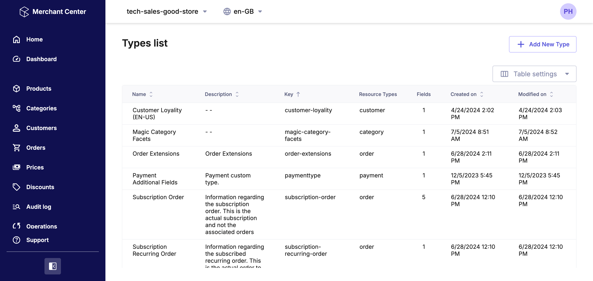
Detail View
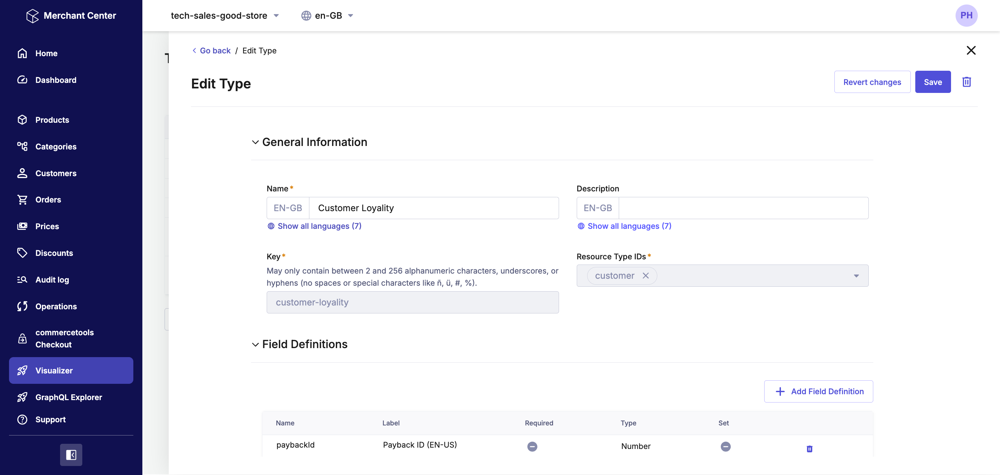
New View
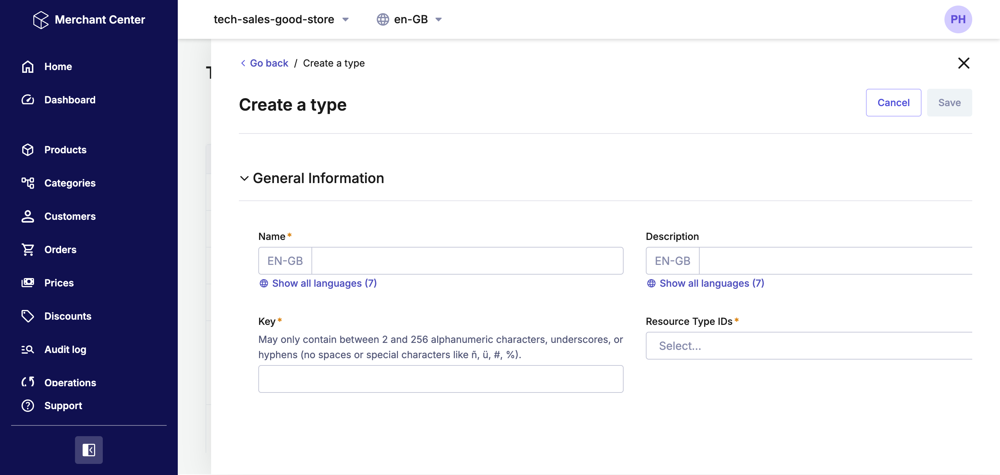

### Custom Objects

List View
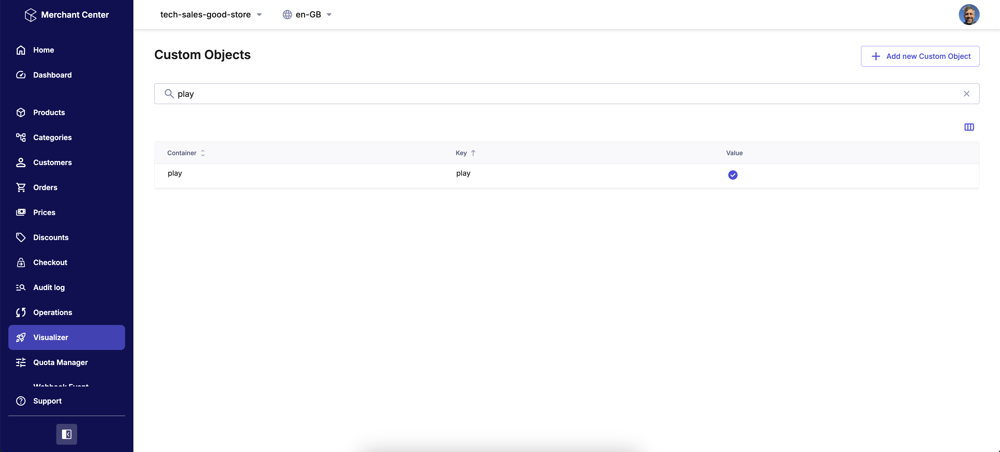
Detail View
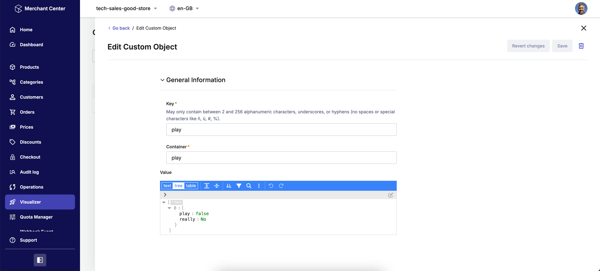

## Local Development

Create a file .env.local within the folder [visualizer](./visualiser) folder like:
```dotenv    
CLOUD_IDENTIFIER=gcp-eu
CUSTOM_APPLICATION_ID=TODO
APPLICATION_URL=https://your_app_hostname.com
INITIAL_PROJECT_KEY=YOUR_PROJECT_KEY
```
Run the following commands

```shell    
cd ./visualiser
yarn install
yarn run start
```

The code has been built sucessfully using 
* Node v18.12.0
* Yarn 1.22.22

## Known issues
 - On Subscriptions:
   - only GCP is currently supported
 - On Types
   - Deleting enum and localized enum values is not supported
   - Change order of enum and localized enum values is not supported
 - On Carts
   - Support for `Line Items` only, not for `Custom Line Items`